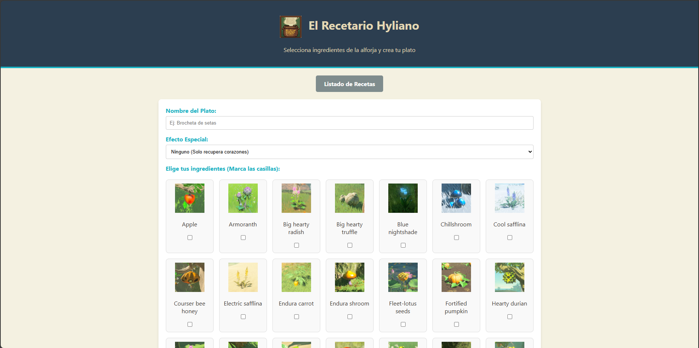
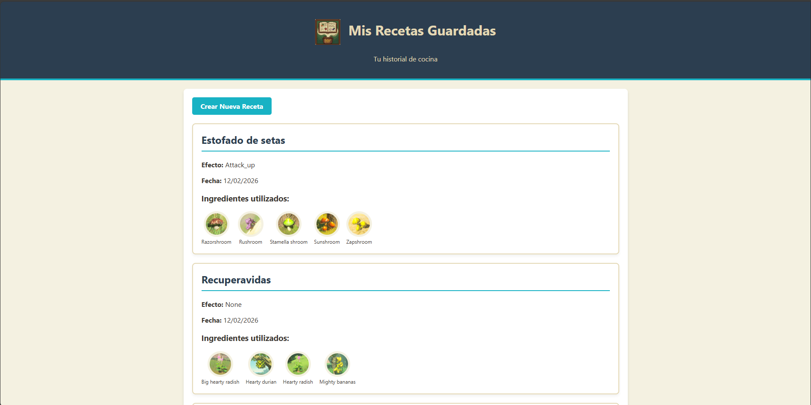

# El Recetario Hyliano


Gestor de cocina para *The Legend of Zelda: Breath of the Wild* desarrollado en Laravel. Esta aplicación soluciona la falta de persistencia de recetas en el juego original, permitiendo a los usuarios crear, guardar y consultar fórmulas personalizadas.

El sistema combina una base de datos local para la persistencia de usuarios y recetas con una API externa para la obtención de metadatos de ingredientes en tiempo real.

## Motivación Técnica
Este proyecto fue concebido para demostrar competencias backend específicas en un entorno académico:
* **Integración de APIs:** Consumo de servicios RESTful externos.
* **Arquitectura Híbrida:** Relaciones Eloquent complejas (N:M) combinadas con datos no persistidos (API).
* **Performance:** Implementación de estrategias de Caché para optimizar tiempos de respuesta y rate-limiting.

## Arquitectura y Funcionalidad

**Consumo de API y Caché**
La aplicación consulta la [Hyrule Compendium API](https://botw-compendium.herokuapp.com/). Para evitar latencia y respetar los límites de la API, las respuestas se almacenan en la caché de Laravel (driver `file` o `redis`) durante 60 minutos.

**Modelo de Datos Híbrido**
A diferencia de un CRUD estándar, aquí no se duplica la base de datos de ingredientes.
1.  **Local (MySQL):** Guarda el ID de la receta, el usuario propietario y las referencias (IDs) de los ingredientes.
2.  **Remoto (API):** Provee los nombres, descripciones e imágenes de los ingredientes al momento de renderizar la vista.

## Capturas de Interfaz

| Editor de Recetas | Colección Personal |
| :---: | :---: |
|  |  |

## Instalación

1. **Clonar repositorio**
    ```bash
    git clone [https://github.com/TU_USUARIO/TU_REPOSITORIO.git](https://github.com/TU_USUARIO/TU_REPOSITORIO.git)
    cd TU_REPOSITORIO
    ```
2. **Instalar dependencias y entorno**
    ```bash
    composer install
    cp .env.example .env
    php artisan key:generate
    ```
3. **Base de Datos Configura las credenciales en el archivo .env y ejecuta las migraciones:**
    ```bash
    php artisan migrate
    ```
4. **Seeders (Opcional) Para crear un usuario de prueba rápidamente:**
    ```bash
    php artisan tinker
    > \App\Models\User::factory()->create(['email' => 'link@hyrule.com']);
    ```
5. **Ejecutar**
    ```bash
    php artisan serve
    ```
La aplicación estará disponible en http://127.0.0.1:8000/recetas

## 🛠️ Tecnologías y Recursos Utilizados
- Backend: Laravel 10/11 (PHP)
- Base de Datos: MySQL
- Frontend: Blade Templating Engine, CSS3 puro.
- API Externa: [Hyrule Compendium API](https://botw-compendium.herokuapp.com/) by gadhagod
